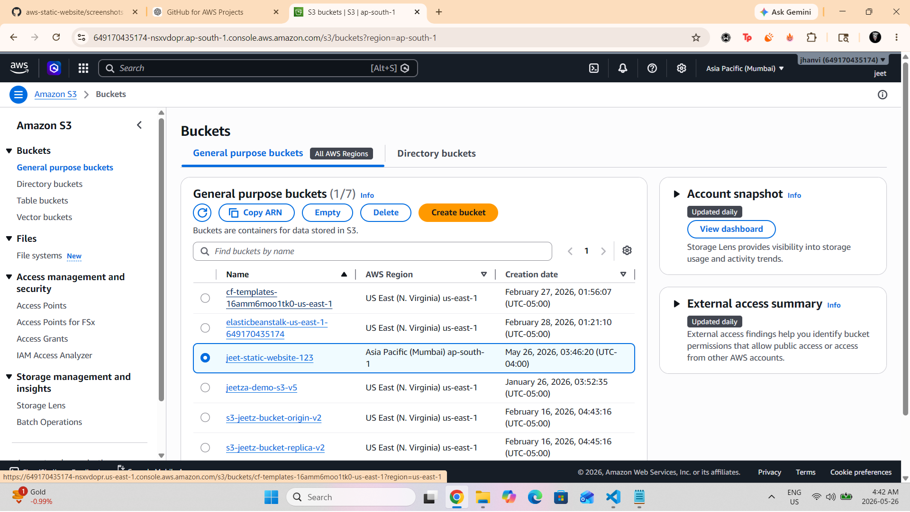
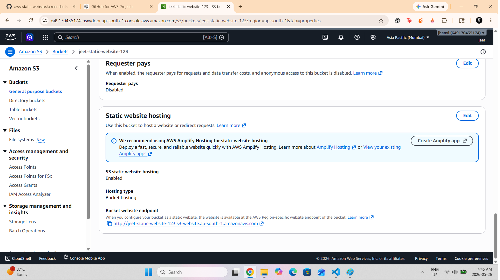
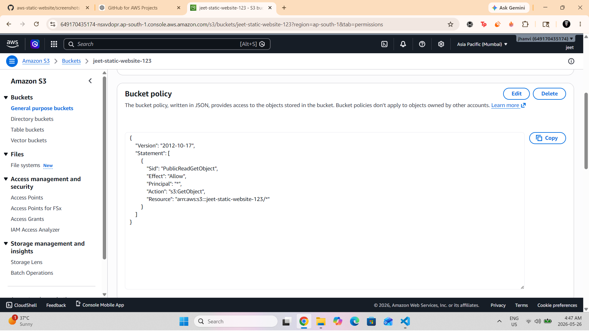
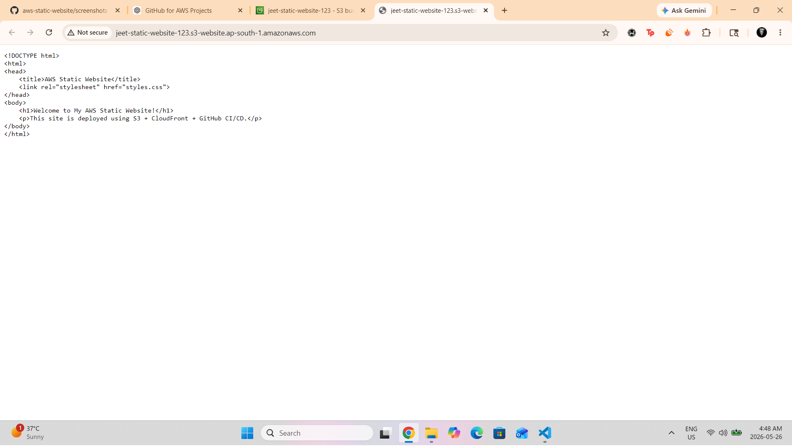

<h1 align="center">🌐 AWS Static Website Hosting Project</h1>

  Deploying a fully static website on <b>Amazon S3</b> with public hosting, bucket policies, and GitHub version control.

  
  
  
  

---

## 🚀 Overview

This project showcases how to deploy a **static website** using **Amazon S3** with public access controls, bucket policies, and static website hosting enabled. The website is uploaded directly to an S3 bucket and served to the internet using AWS's built-in hosting capabilities.

---

## 🧩 Features

- 🌍 Static Website Hosting on Amazon S3  
- 🔐 Correct public access & bucket policies  
- 📁 Organized folder structure  
- ⚡ Fast hosting without servers  
- 🧪 Tested live on S3 endpoint  
- 🛠 Version controlled using Git & GitHub  

---

## 🛠 Tech Stack

| Area | Technology |
|------|------------|
| Cloud Platform | Amazon S3 |
| Frontend | HTML, CSS |
| Tools | Git, GitHub |
| Hosting | S3 Static Website Hosting |

---

## 🌐 Live Website  
http://jeet-static-website-123.s3-website.ap-south-1.amazonaws.com

---

## 📂 Folder Structure

---

## 📝 What I Learned

- How to host a static website on **AWS S3**  
- How to configure **bucket policies** for public access  
- How to fix common permission errors (403/404)  
- How S3 **Static Website Hosting** works  
- How to upload and manage project files with **GitHub**  
- Understanding **S3 URL vs Website Endpoint**  

---

## 🖼 Screenshots

### 📌 1. S3 Bucket Overview  

### 📌 2. Static Hosting Settings  

### 📌 3. Bucket Policy Configuration  

### 📌 4. Live Website Preview  

---

## 🏁 How to Run

No installation required.  
Simply open the **S3 Website Endpoint** in your browser.

---

## 📘 Future Improvements

- Add custom domain using Route 53  
- Add HTTPS using CloudFront  
- Add backend using AWS Lambda  
- Add CI/CD pipeline with GitHub Actions  

---

## 🤝 Connect With Me

- **LinkedIn:** Your link here  
- **GitHub:** Your profile link here  

---

Made with ❤️ using Amazon S3 + GitHub

